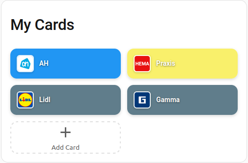
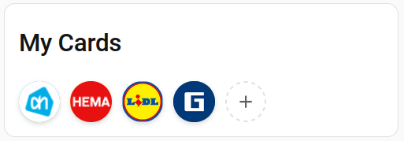
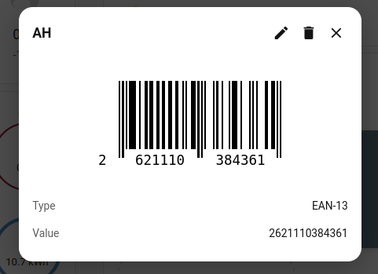

<p align="center">
  
</p>

# CardVault

A Home Assistant custom integration for managing your loyalty and discount cards. Store all your shopping cards in one place and display their barcodes on your dashboard.

<p align="center">
  
  
  
</p>

## Features

- Store loyalty/discount cards with barcodes
- Supports EAN-13, EAN-8, Code 128, Code 39, QR Code, and UPC-A
- Add cards by manually entering barcode data or by scanning from a photo
- Store front/back images of your physical cards
- Auto-fetched store logos for card branding
- Two layout modes: grid tiles or compact circle icons
- Use an uploaded card image as the tile background
- Custom Lovelace card with tap-to-show-barcode
- Fully local - no cloud services required

## Installation

### HACS (Recommended)

1. Open HACS in your Home Assistant instance
2. Go to **Integrations**
3. Click the **three dots** menu in the top right and select **Custom repositories**
4. Add this repository URL and select **Integration** as the category
5. Click **Download**
6. Restart Home Assistant

### Manual

1. Copy the `custom_components/cardvault` folder to your `config/custom_components/` directory
2. Restart Home Assistant

## Setup

1. Go to **Settings** > **Devices & Services**
2. Click **Add Integration** and search for **CardVault**
3. Click through the setup (no configuration needed)

## Usage

1. Edit any dashboard and add a new card
2. Search for **CardVault** in the card picker
3. The card will appear showing your stored cards
4. Click the **+** button to add your first card
5. Tap any card to view its barcode at full size

### Adding a Card

You can add cards in two ways:

- **Manual entry**: Type the card name, barcode number, and select the barcode type
- **Scan from photo**: Click "Scan from Image" and select a photo of your card's barcode - the barcode data will be extracted automatically

You can also upload photos of the front and back of your card for reference.

### Card Configuration

In the Lovelace card editor, you can set:
- **Title**: The header text (default: "My Cards")
- **Layout**: Grid tiles or compact circle icons
- **Columns**: Number of columns in the grid (0 = auto)

## Prerequisites

The barcode scanning feature requires `libzbar0` to be installed on your system:

### Home Assistant OS / Supervised

The library should be available. If scanning doesn't work, install via SSH:

```bash
apk add zbar
```

### Docker

Add to your Dockerfile:

```dockerfile
RUN apt-get update && apt-get install -y libzbar0
```

### Home Assistant Core (venv)

```bash
sudo apt-get install libzbar0
```

## License

MIT
